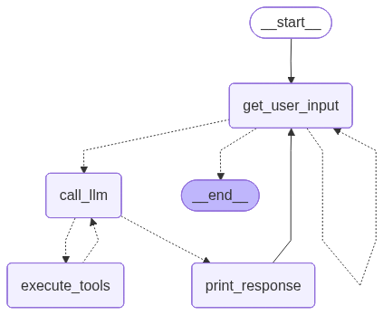

# Task 1.1

(base) nathanctodd@NathanTodd Lab 3 - Agent Tool Use % time {python llama_mmlu_eval.py ; python llama_mmlu_eval_ollama.py }

Llama 3.2-1B MMLU Evaluation (Quantized)

### Environment Check
✔ Running locally (not in Colab)
✔ Platform: Darwin (arm64)
✔ Processor: arm
✔ Apple Metal (MPS) Available
✔ Using Metal Performance Shaders for GPU acceleration
✔ Quantization disabled - loading full precision model
Hugging Face authenticated

### Configuration
Model: meta-llama/Llama-3.2-1B-Instruct
Device: mps
Quantization: None (full precision)
Expected memory: ~2.5 GB (FP16)
Number of subjects: 1


Loading model meta-llama/Llama-3.2-1B-Instruct...
Device: mps
Tokenizer loaded
Loading model (this may take 2-3 minutes)...
Model loaded successfully!
  Model device: mps:0
  Model dtype: torch.float16
  Running on Apple Metal (MPS)

### Starting evaluation on 1 subjects


Progress: 1/1 subjects


### Evaluating subject: astronomy
Testing astronomy:   0%|          | 0/152 [00:00<?, ?it/s]The following generation flags are not valid and may be ignored:

Testing astronomy: 100%|██████████| 152/152 [00:57<00:00,  2.64it/s]
Result: 76/152 correct = 50.00%

### EVALUATION SUMMARY

Model: meta-llama/Llama-3.2-1B-Instruct
None (full precision)
Total Subjects: 1
Total Questions: 152
Total Correct: 76
Overall Accuracy: 50.00%
Duration: 1.0 minutes

Evaluation complete!

### Llama 3.2-1B MMLU Evaluation (Ollama)

### Environment Check
Ollama server is running
Model 'llama3.2:1b' is available
Subject: astronomy


### Evaluating subject: astronomy
Testing astronomy: 100%|██████████| 152/152 [00:36<00:00,  4.20it/s]

Result: 27/152 correct = 17.76%

### EVALUATION SUMMARY
Model: llama3.2:1b
Subject: astronomy
Total Questions: 152
Total Correct: 27
Accuracy: 17.76%
Duration: 0.6 minutes

Evaluation complete!


# Task 1.2

(base) nathanctodd@NathanTodd Lab 3 - Agent Tool Use % time {python llama_mmlu_eval.py & python llama_mmlu_eval_ollama.py & wait; }
[2] 92370
[3] 92371

Llama 3.2-1B MMLU Evaluation (Ollama)

### Environment Check
Ollama server is running
Model 'llama3.2:1b' is available
Subject: astronomy


### Evaluating subject: astronomy

Testing astronomy:   0%|       | 0/152 [00:00<?, ?it/s]
Llama 3.2-1B MMLU Evaluation (Quantized)

### Environment Check
✔ Running locally (not in Colab)
✔ Platform: Darwin (arm64)
✔ Processor: arm
✔ Apple Metal (MPS) Available
✔ Using Metal Performance Shaders for GPU acceleration
Quantization disabled - loading full precision model
Hugging Face authenticated

### Configuration
Model: meta-llama/Llama-3.2-1B-Instruct
Device: mps
Quantization: None (full precision)
Expected memory: ~2.5 GB (FP16)
Number of subjects: 1


Loading model meta-llama/Llama-3.2-1B-Instruct...
Device: mps
Testing astronomy:  87%|██████████████████████▋              | 132/152 [00:38<00:06,  2.99it/s]Model loaded successfully!
  Model device: mps:0
  Model dtype: torch.float16
  Running on Apple Metal (MPS)

### Starting evaluation on 1 subjects

Progress: 1/1 subjects

Testing astronomy: 100%|█████████████████████████| 152/152 [00:43<00:00,  3.51it/s]
Result: 27/152 correct = 17.76%

### EVALUATION SUMMARY
Model: llama3.2:1b
Subject: astronomy
Total Questions: 152
Total Correct: 27
Accuracy: 17.76%
Duration: 0.8 minutes

Evaluation complete!
[3]  + done       python3.10 llama_mmlu_eval_ollama.py
Testing astronomy: 100%|█████████████████████| 152/152 [00:40<00:00,  3.72it/s]
Result: 76/152 correct = 50.00%

### EVALUATION SUMMARY
Model: meta-llama/Llama-3.2-1B-Instruct
None (full precision)
Total Subjects: 1
Total Questions: 152
Total Correct: 76
Overall Accuracy: 50.00%
Duration: 0.8 minutes

Evaluation complete!
[2]  + done       python3.10 llama_mmlu_eval.py


# Task 2.1

Signed up for an OpenAI account and obtained an API key. Here are the descriptions of the various lines of code posted:

1.      client = OpenAI()
  
  This line initializes the OpenAI client, which is used to interact with OpenAI's API. It automatically uses the API key set in the environment variable `OPENAI_API_KEY`. 

2.      response = client.chat.completions.create(
                        model="gpt-4o-mini",
                        messages=[{"role": "user", "content": "Say: Working!"}],
                        max_tokens=5)
This block of code sends a request to the OpenAI API to create a chat completion using the "gpt-4o-mini" model. It provides a message from the user asking the model to respond with "Working!". The `max_tokens=5` parameter limits the response to a maximum of 5 tokens. 


# Task 3

I implemented a simple tool in the code to be able to calculate either the sin, cos, or tan of a given angle in either degrees or radians. The tool takes three inputs: the function to be calculated (sin, cos, or tan), the angle value, and the unit of the angle (degrees or radians). Here is the output of my code:

```
(base) nathanctodd@NathanTodd Lab 3 - Agent Tool Use % python manual_tool_calling.py
============================================================
TEST 1: Query requiring tool
============================================================
User: What is sin of 32 degrees?

--- Iteration 1 ---
LLM wants to call 1 tool(s)
  Tool: calculate_geometric_function
  Args: {'function': 'sin', 'angle_type': 'degrees', 'angle': 32}
  Result: The sin of 32 degrees is 0.5299192642332049

--- Iteration 2 ---
Assistant: The sine of 32 degrees is approximately 0.5299.
```


# Task 4

I setup two new functions, one that could compute the derivative of a given mathematical expression with respect to a specified variable, and another that could count the occurrences of a specific character in a given string. I also managed to get the agent to run three tools in a row to answer a more complex question. Here is the output of my code: 

```
(agentic) nathanctodd@NathanTodd Lab 3 - Agent Tool Use % python tool_calling_langchain.py
============================================================
TEST 1: Query using character counting tool
============================================================
User: How many times does the letter 's' appear in Mississippi riverboats?

--- Iteration 1 ---
LLM wants to call 1 tool(s)
  Tool: count_character_in_string
  Args: {'input_string': 'Mississippi riverboats', 'character': 's'}
  Result: The character 's' occurs 5 times in the given string.

--- Iteration 2 ---
Assistant: The letter 's' appears 5 times in "Mississippi riverboats."

============================================================
TEST 2: Query using derivative computation tool
============================================================
User: What is the derivative of x^2 + 3*x + 2 with respect to x?

--- Iteration 1 ---
LLM wants to call 1 tool(s)
  Tool: compute_derivative
  Args: {'expression': 'x^2 + 3*x + 2', 'variable': 'x'}
  Result: The derivative of x^2 + 3*x + 2 with respect to x is 2*x + 3

--- Iteration 2 ---
Assistant: The derivative of \( x^2 + 3x + 2 \) with respect to \( x \) is \( 2x + 3 \).

============================================================
TEST 3: Query using geometric function tool
============================================================
User: What is the sin of the difference between the number of s's and the number of p's in Mississippi riverboats

--- Iteration 1 ---
LLM wants to call 2 tool(s)
  Tool: count_character_in_string
  Args: {'input_string': 'Mississippi riverboats', 'character': 's'}
  Result: The character 's' occurs 5 times in the given string.
  Tool: count_character_in_string
  Args: {'input_string': 'Mississippi riverboats', 'character': 'p'}
  Result: The character 'p' occurs 2 times in the given string.

--- Iteration 2 ---
LLM wants to call 1 tool(s)
  Tool: calculate_geometric_function
  Args: {'function': 'sin', 'angle_type': 'degrees', 'angle': 3}
  Result: The sin of 3.0 degrees is 0.052335956242943835

--- Iteration 3 ---
Assistant: The character 's' occurs 5 times, and the character 'p' occurs 2 times in "Mississippi riverboats." 

The difference between the number of 's's and 'p's is \(5 - 2 = 3\). 

The sine of 3 degrees is approximately \(0.0523\).
```

As you can see, the agent called the character counting tool twice to get the counts of 's' and 'p', calculated the difference, and then called the geometric function tool to compute the sine of that difference.

# Task 5

    (agentic) nathanctodd@NathanTodd Lab 3 - Agent Tool Use % python tool_calling_langchain.py           
    LangGraph Tool-Calling Agent with Checkpointing
    Graph image saved to tool_agent_graph.png

    Enter your message (or 'quit' to exit):


    > Hi there! I want to know the derivative of 3 * x^2 + 2 * x

    Thinking...
      Tool: compute_derivative
      Args: {'expression': '3 * x^2 + 2 * x', 'variable': 'x'}
      Result: The derivative of 3 * x^2 + 2 * x with respect to x is 6*x + 2

    Thinking...

    ------------------------------------------------------------
    Assistant:
    ------------------------------------------------------------
    The derivative of \( 3x^2 + 2x \) with respect to \( x \) is \( 6x + 2 \).


    Enter your message (or 'quit' to exit):


    > Great! Now can you tell me about the number of s characters in the word strawberries?

    Thinking...
      Tool: count_character_in_string
      Args: {'input_string': 'strawberries', 'character': 's'}
      Result: The character 's' occurs 2 times in the given string.

    Thinking...

    ------------------------------------------------------------
    Assistant:
    ------------------------------------------------------------
    The character 's' occurs 2 times in the word "strawberries."


    Enter your message (or 'quit' to exit):


    > quit
    Goodbye!




6. Question: Where is there an opportunity for parallelization in your agent that is not yet being taken advantage of?

- One area that comes to mind for me to parallelize is when the agent needs to call multiple tools to answer a single query. For example, in the previous example where the agent needed to count the occurrences of 's' and 'p' in "Mississippi riverboats", these two counting operations could be executed in parallel since they are independent of each other. By parallelizing these tool calls, the overall response time of the agent could be reduced, leading to a more efficient and faster user experience.